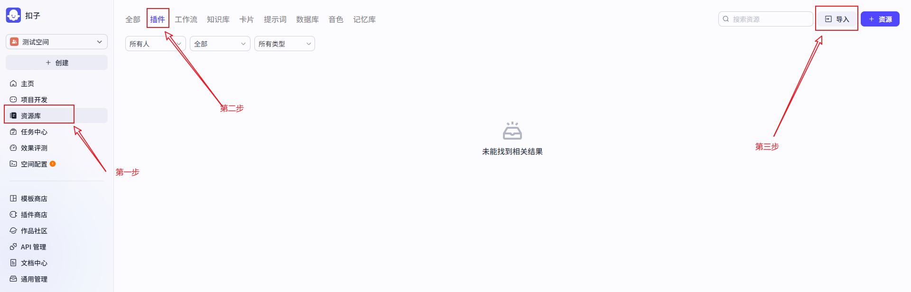
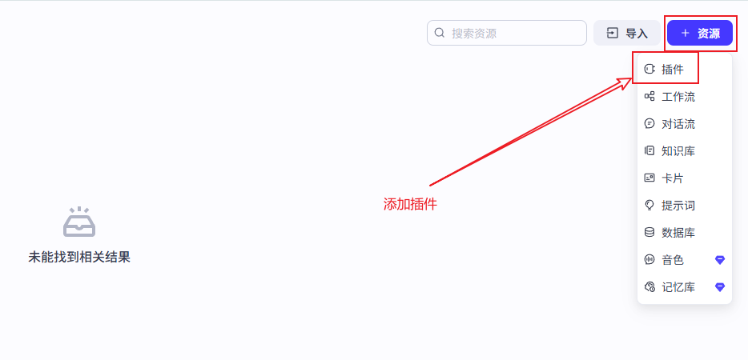
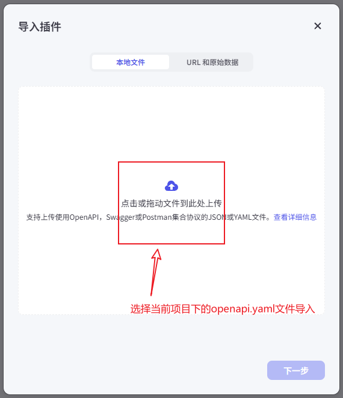
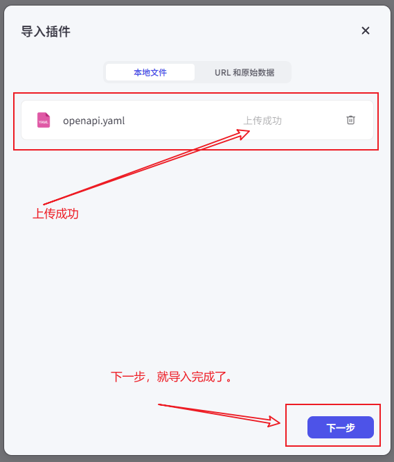
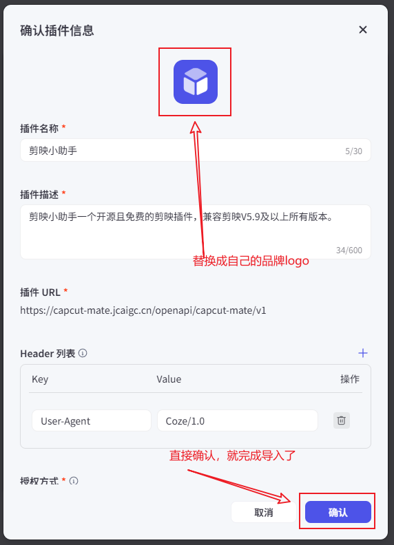
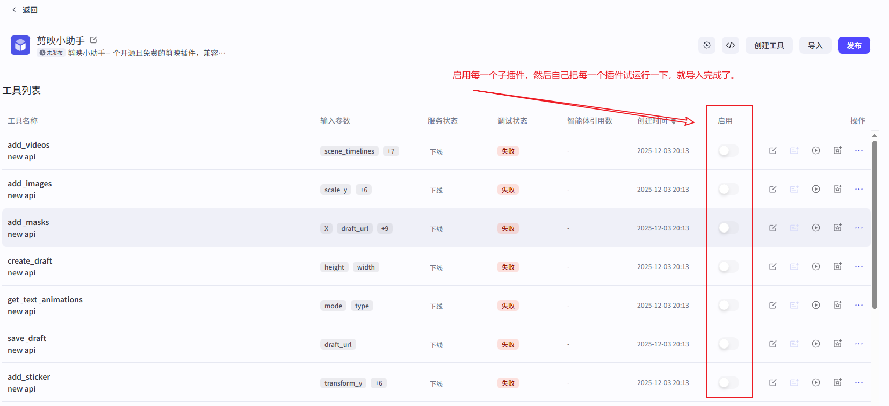

# CapCut Mate API

<div align="center">

### 🌐 语言切换

[中文版](README.zh.md) | [English](README.md)

</div>

---

## 项目简介
CapCut Mate API 是一款完全**开源免费**、基于 FastAPI构建的剪映草稿自动化助手，支持**独立部署**。本项目专注于为大模型赋能基础视频编辑能力，提供开箱即用的视频剪辑 **Skills**，已将剪映核心功能全流程自动化。可直接对接大模型实现多样化智能视频剪辑，让普通用户也能快速制作出专业高级的视频作品。

项目使用灵活：既可独立部署，也可**结合 Coze 或 n8n自动化工作流**，还能对接剪映实现**云渲染**，直接将草稿生成最终视频。

## 项目相关资源
- [⭐ 剪映小助手](https://github.com/Hommy-master/capcut-mate)
- [🔌 剪映小助手-扣子插件](https://www.coze.cn/store/plugin/7576197869707722771)
- [🔗 工作流案例](https://jcaigc.cn/workflow)

⭐ 如果您觉得这个项目对您有点帮助，麻烦点个 Star 支持一下！您的支持是我持续维护和改进项目的最大动力 😊

## 功能特点
- 🎬 草稿管理：创建草稿、获取草稿、保存草稿
- 🎥 素材添加：添加视频、音频、图片、贴纸、字幕、特效、遮罩等
- 🔧 高级功能：关键帧控制、文字样式、动画效果等
- 📤 视频导出：云端渲染生成最终视频
- 🛡️ 数据验证：使用 Pydantic 进行请求数据验证
- 📖 RESTful API：符合标准的 API 设计规范
- 📚 自动文档：FastAPI 自动生成交互式 API 文档

## 技术栈
- Python 3.11+
- FastAPI：高性能的 Web 框架
- Pydantic：数据验证和模型定义
- Passlib：密码加密（如果使用用户认证）
- Uvicorn：ASGI 服务器
- uv：Python 包管理器和项目管理工具

## 快速开始

### 前提条件
- Python 3.11+
- uv：Python 包管理器和项目管理工具

安装方法:
#### Windows
```powershell
powershell -ExecutionPolicy ByPass -c "irm https://astral.sh/uv/install.ps1 | iex"
```

#### Linux/macOS
```bash
sh -c "$(curl -LsSf https://astral.sh/uv/install.sh)"
```

### 安装步骤
1. 克隆项目
```bash
git clone git@github.com:Hommy-master/capcut-mate.git
cd capcut-mate
```

2. 安装依赖
```bash
# 安装依赖
uv sync

# windows额外执行
uv pip install -e .[windows]
```

3. 启动服务器
```bash
uv run main.py
```

4. 访问API文档
启动后访问 http://localhost:30000/docs 查看自动生成的交互式API文档

### Docker 部署

#### 快速部署（推荐）

📺 **视频教程**：[CapCut Mate 私有化部署完整教程](https://v.douyin.com/5p-o319uA5o/)

```bash
git clone https://github.com/Hommy-master/capcut-mate.git
cd capcut-mate
docker-compose pull && docker-compose up -d
```

部署完成后，访问 API 文档：http://localhost:30000/docs

## 一键导入扣子插件

1. 打开扣子平台：https://coze.cn/home

   

2. 添加插件

   

3. 导入插件

   

4. 上传当前工程目录下的openapi.yaml文件

   

5. 完成文件上传

   

6. 替换logo完成

   

7. 启用插件

   

## API 接口文档

以下是 CapCut Mate API 提供的核心接口，支持完整的视频创作工作流程：

### 🏗️ 草稿管理
| 接口 | 功能 | 描述 | 文档链接 |
|------|------|------|----------|
| **create_draft** | 创建草稿 | 创建新的剪映草稿项目，设置画布尺寸 | [📖 查看文档](./docs/create_draft.zh.md) |
| **save_draft** | 保存草稿 | 保存当前草稿状态，确保编辑内容持久化 | [📖 查看文档](./docs/save_draft.zh.md) |
| **get_draft** | 获取草稿 | 获取草稿文件列表和详细信息 | [📖 查看文档](./docs/get_draft.zh.md) |

### 🎥 视频素材
| 接口 | 功能 | 描述 | 文档链接 |
|------|------|------|----------|
| **add_videos** | 添加视频 | 批量添加视频素材，支持裁剪、缩放、特效 | [📖 查看文档](./docs/add_videos.zh.md) |
| **add_images** | 添加图片 | 批量添加图片素材，支持动画和转场效果 | [📖 查看文档](./docs/add_images.zh.md) |
| **add_sticker** | 添加贴纸 | 添加装饰贴纸，支持位置和大小调整 | [📖 查看文档](./docs/add_sticker.zh.md) |

### 🎵 音频处理
| 接口 | 功能 | 描述 | 文档链接 |
|------|------|------|----------|
| **add_audios** | 添加音频 | 批量添加音频素材，支持音量和淡入淡出 | [📖 查看文档](./docs/add_audios.zh.md) |
| **get_audio_duration** | 获取音频时长 | 获取音频文件的精确时长信息 | [📖 查看文档](./docs/get_audio_duration.zh.md) |

### 📝 文本字幕
| 接口 | 功能 | 描述 | 文档链接 |
|------|------|------|----------|
| **add_captions** | 添加字幕 | 批量添加字幕，支持关键词高亮和样式设置 | [📖 查看文档](./docs/add_captions.zh.md) |
| **add_text_style** | 文本样式 | 创建富文本样式，支持关键词颜色和字体 | [📖 查看文档](./docs/add_text_style.zh.md) |

### ✨ 特效动画
| 接口 | 功能 | 描述 | 文档链接 |
|------|------|------|----------|
| **add_effects** | 添加特效 | 添加视觉特效，如滤镜、边框、动态效果 | [📖 查看文档](./docs/add_effects.zh.md) |
| **add_keyframes** | 关键帧动画 | 创建位置、缩放、旋转等属性动画 | [📖 查看文档](./docs/add_keyframes.zh.md) |
| **add_masks** |遮罩效果 | 添加各种形状遮罩，控制画面可见区域 | [📖 查看文档](./docs/add_masks.zh.md) |

### 🎨 动画资源
| 接口 | 功能 | 描述 | 文档链接 |
|------|------|------|----------|
| **get_text_animations** | 文本动画 | 获取可用的文本入场、出场、循环动画 | [📖 查看文档](./docs/get_text_animations.zh.md) |
| **get_image_animations** | 图片动画 | 获取可用的图片动画效果列表 | [📖 查看文档](./docs/get_image_animations.zh.md) |

### 🎬 视频生成
| 接口 | 功能 | 描述 | 文档链接 |
|------|------|------|----------|
| **gen_video** | 生成视频 | 提交视频渲染任务，异步处理 | [📖 查看文档](./docs/gen_video.zh.md) |
| **gen_video_status** | 查询状态 | 查询视频生成任务的进度和状态 | [📖 查看文档](./docs/gen_video_status.zh.md) |

### 🚀 快速工具
| 接口 | 功能 | 描述 | 文档链接 |
|------|------|------|----------|
| **easy_create_material** |快速创建 | 一次性添加多种类型素材，简化创建流程 | [📖 查看文档](./docs/easy_create_material.zh.md) |

### 🛠️工具类接口
|接口 |功能 |描述 | 文档链接 |
|------|------|------|----------|
| **get_url** | 提取URL | 从输入内容中提取URL信息 | [📖 查看文档](./docs/get_url.zh.md) |
| **search_sticker** |搜索贴纸 |根据关键词搜索贴纸素材 | [📖 查看文档](./docs/search_sticker.zh.md) |
| **objs_to_str_list** | 对象转字符串列表 |将对象列表转换为字符串列表格式 | [📖 查看文档](./docs/objs_to_str_list.zh.md) |
| **str_list_to_objs** | 字符串列表转对象 |将字符串列表转换为对象列表格式 | [📖 查看文档](./docs/str_list_to_objs.zh.md) |
| **str_to_list** | 字符串转列表 |将字符串转换为列表格式 | [📖 查看文档](./docs/str_to_list.zh.md) |
| **timelines** | 创建时间线 | 生成视频编辑所需的时间线配置 | [📖 查看文档](./docs/timelines.zh.md) |
| **audio_timelines** |音频时间线 |根据音频时长计算时间线 | [📖 查看文档](./docs/audio_timelines.zh.md) |
| **audio_infos** |音频信息 |根据URL和时间线生成音频信息 | [📖 查看文档](./docs/audio_infos.zh.md) |
| **imgs_infos** | 图片信息 |根据URL和时间线生成图片信息 | [📖 查看文档](./docs/imgs_infos.zh.md) |
| **caption_infos** | 字幕信息 |根据文本和时间线生成字幕信息 | [📖 查看文档](./docs/caption_infos.zh.md) |
| **effect_infos** |特信息 | 根据名称和时间线生成特效信息 | [📖 查看文档](./docs/effect_infos.zh.md) |
| **keyframes_infos** | 关键帧信息 | 根据配置生成关键帧信息 | [📖 查看文档](./docs/keyframes_infos.zh.md) |
| **video_infos** |视信息信息 | 根据URL和时间线生成视频信息 | [📖 查看文档](./docs/video_infos.zh.md) |

## API 使用示例

### 工作流案例

查看完整的真实工作流案例，了解如何将 CapCut Mate 接口与 Coze、n8n 等自动化平台结合使用：

👉 [访问工作流案例](https://jcaigc.cn/workflow)

### 创建草稿
```bash
curl -X POST "http://localhost:30000/openapi/capcut-mate/v1/create_draft" \
-H "Content-Type: application/json" \
-d '{"width": 1080, "height": 1920}'
```

### 添加视频
`video_infos` 为 **JSON 字符串**（请求体里不能写成嵌套数组）。每条记录须包含 `video_url`、`start`、`end`（时间轴上的微秒）。可选字段见 [add_videos](./docs/add_videos.zh.md)。

```bash
curl -X POST "http://localhost:30000/openapi/capcut-mate/v1/add_videos" \
-H "Content-Type: application/json" \
-d '{
  "draft_url": "http://localhost:30000/openapi/capcut-mate/v1/get_draft?draft_id=20251126212753cab03392",
  "video_infos": "[{\"video_url\": \"https://example.com/video.mp4\", \"start\": 0, \"end\": 1000000}]"
}'
```

## API 文档
- 本地访问: http://localhost:30000/docs
- ReDoc 版本: http://localhost:30000/redoc

## 剪映小助手客户端

剪映小助手客户端提供了桌面端的便捷操作界面，以下是启动方法：

### macOS 沙箱权限说明

在 macOS 上运行时，应用可能会请求访问特定文件夹的权限。请按照以下步骤操作：

1. 如果首次运行时出现权限提示，请允许应用访问所需文件夹
2. 如需手动配置，请前往 `系统偏好设置 > 安全性与隐私 > 隐私 > 文件夹访问`
3. 确保 CapCut Mate 应用已被添加到允许列表中

更多详细信息，请参阅 [macOS 沙箱权限配置指南](./docs/macos_sandbox_setup.md)。

1. 安装依赖

```bash
# 切换npm镜像源 - 适用于windows
set ELECTRON_MIRROR=https://npmmirror.com/mirrors/electron/

# 切换yarn镜像源 - 适用于linux 或 mac
export ELECTRON_MIRROR="https://npmmirror.com/mirrors/electron/"

# 安装依赖
npm install --verbose
```

2. 启动项目

```bash
npm run web:dev
npm start
```

## 联系方式

| 类型 | 方式 | 说明 |
|------|------|------|
| 📱 微信群 | <div align="center"></div> | 开源社区问题交流群 |
| 💬 微信 | <div align="center"></div> | 商业合作 |
| 📧 邮箱 | taohongmin51@gmail.com | 技术支持 |

---